# Austin Benny's Portfolio

Welcome to my projects page! Here's a soothing picture if you're having a rough day.

NOTE: Work that I did for Framatome, most of the work for TREL, and some work for ANSYS is protected under export control and/or proprietary. So I can't share anything of value.

Thanks in advance for reading!

## Framatome

Unfortunately, I'm still trying to figure what I can show from the work I did at Framatome. Please ask me about this, so I can try to visually explain it to you haha.

The work I did in creating the Neutronics Automation Python package was based on [this](https://www.nrc.gov/docs/ML2022/ML20223A018.pdf) report. As you can see, it is sparse in details.

The work I did with the Flow Induced Vibration Python package is based around the theory described in [this](https://asmedigitalcollection.asme.org/pressurevesseltech/article-abstract/122/3/339/449710/Flow-Induced-Vibrations-in-Power-and-Process-Plant?redirectedFrom=fulltext) book.

The work I did for the Bolted Stress Python package was based on the equations found [here](https://mechanicalc.com/calculators/bolt-pattern-force-distribution/) but tuned to comply with ASME BPVC regulations.

The Reactor Vessel Internals degradation work was based on the observation below. When everything is working, the Reactor Vessel vibrates in a certain way. When something is broken, the Reactor Vessel vibrates differently. So, the question becomes, given the vibration, can we predict the component inside the Reactor Vessel that has been broken.

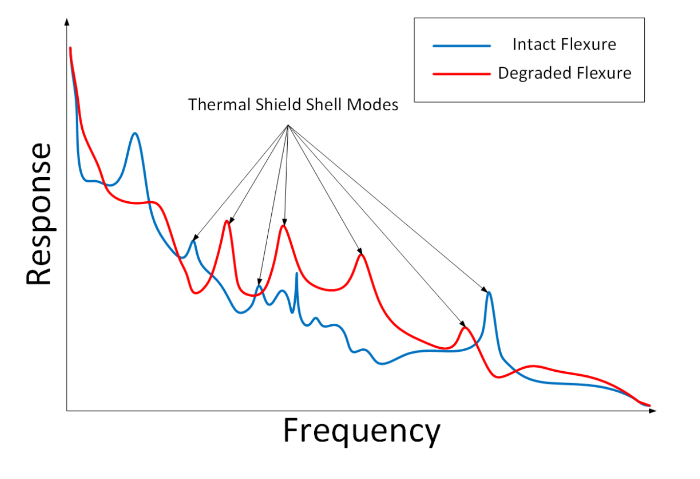

## Texas Rocket Engineering Lab

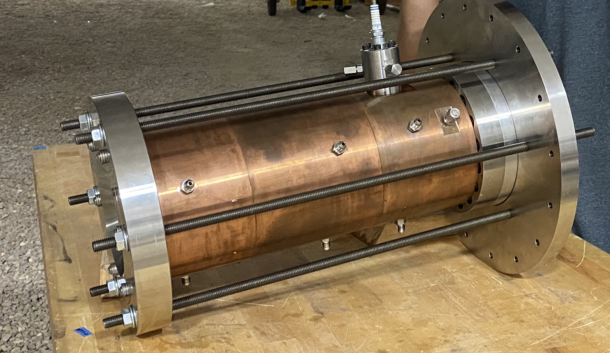

Above is the modularized heat-sink thrust chamber that I designed with my team. We wanted to make our hot-fire test as cost-effective and reduce the overall time of the test. For this purpose, we designed a modularized heat sink chamber where we could slide and bolt modules into place that increased length (and therefore L-star) instead of replacing the entire engine at every burn. The main propulsion purpose was to optimize L-star and combustion efficiency (currently determining how to optimize c-star).

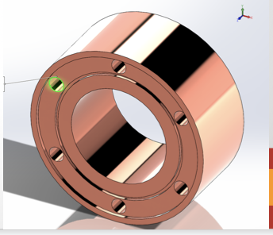

A module from the above chamber looks like this. There is room for an o-ring and holes for the bolts. I had code that calculated the maximum and minimum length of our thrust chamber as a function of L-star since L-star is an experimentally gauged property using our fuel and oxidizer combination.

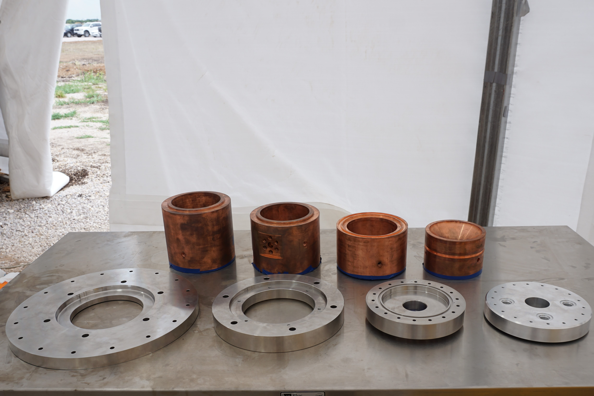

This is what the manufactured variable length heat sink looks like. All the design work was done in solid works through multiple iterations and concepts.

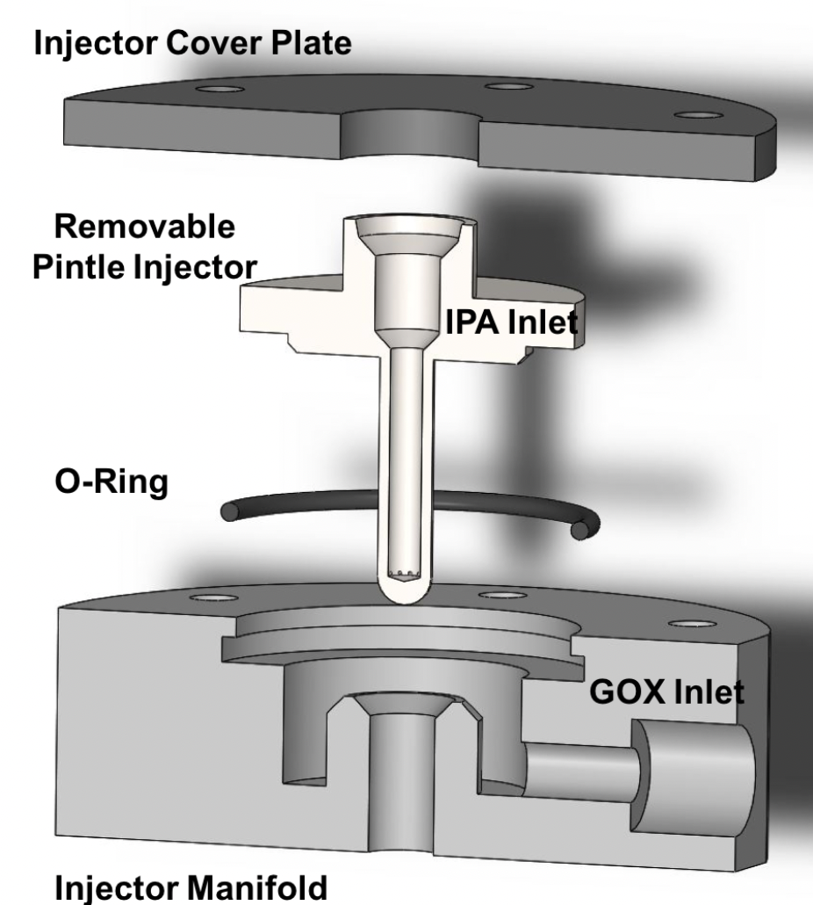

NOTE: Similar pintle injector concept designed in SolidWorks

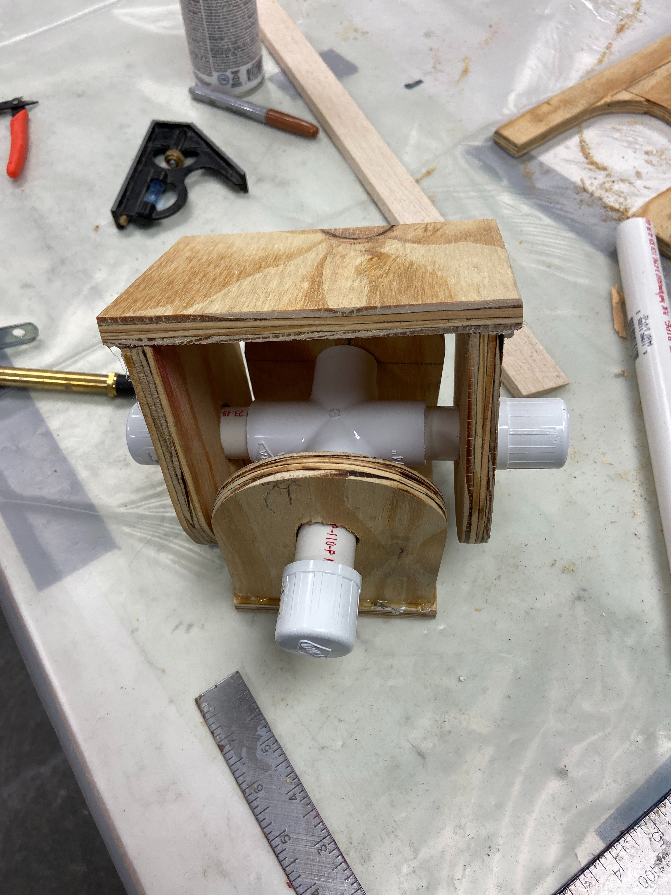

This is the double clevice gimbal assembly that I rapid-prototyped with the Thrust Vector Control team for the Texas rocket engineering lab. It is a non-functional part meant as a proof of concept. One surface will be connected to the injector and the other will be connected to the engine mount (or this is how we have planned it as of 12/05/2019). This is a low-fi creation of the gimbal; the actual gimbal will be made out of sterner stuff.

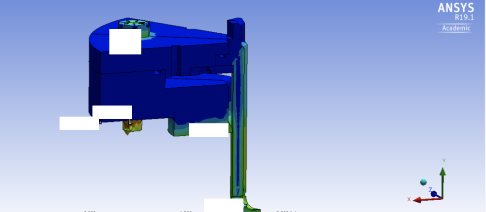

This is 1/12 of the pintle designed using SolidWorks. All BC's are symmetrical, so computational domain was reduced x1/12 to decrease computation time. A publicly available picture a pintle injector similar to the one designed is shown below.

This is a coupled transient-thermal and structural simulation done on ANSYS Mechanical. I only simulated 1/12 of the entire pintle using the mechanical symmetry boundary condition. The material was Inconel 718 so the 1.5e5 psi is below the yield strength. 

Some boundary conditions include: Bolt preload, radiation flux, convection flux, conduction, and a lot of pressures. Bolting simulating assemblies is fun, the contact are the best part (he said sarcastically).

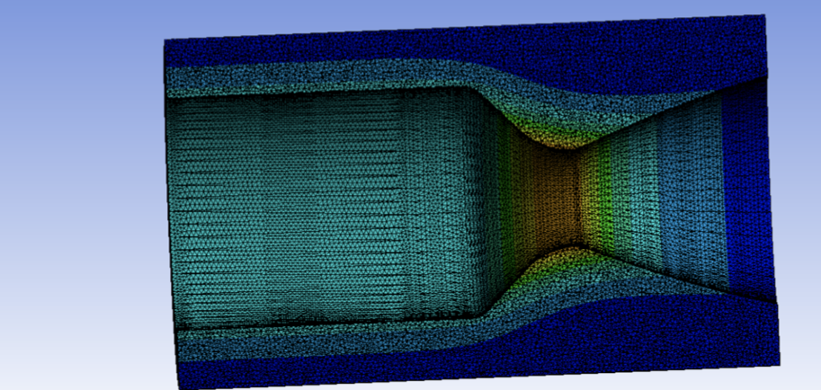

This is a thermal simulation I did for the hot fire heat sink thrust chamber. The BC used was heat transfer coefficients along the axial direction given by RocketCEA. The need for this sim was due to a concern in the throat melting before the final time of our hot fire. It does not, phew!

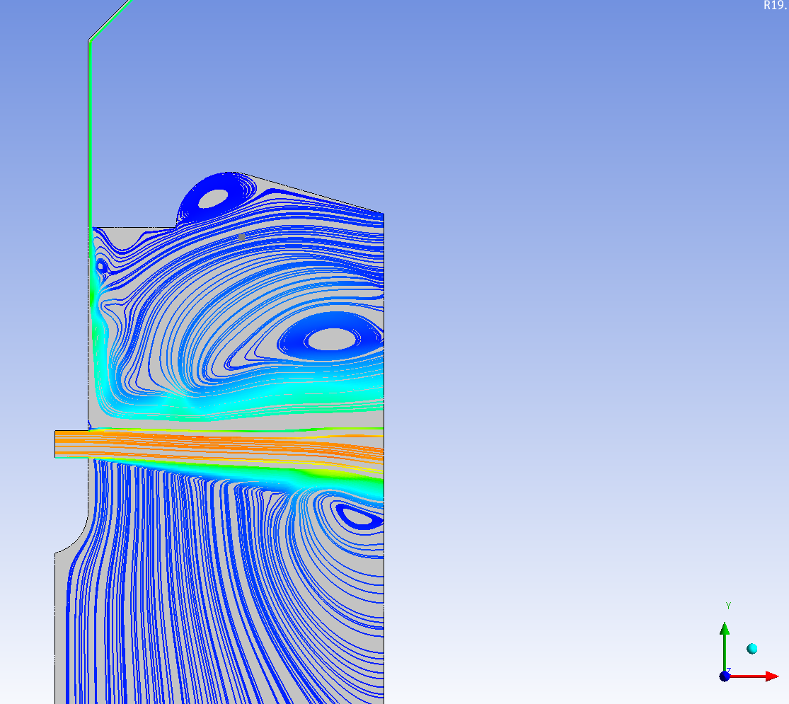

This is the first combustion simulation (on an older pintle design)  that was done in conjunction with a variety of people. The boundary on the right side is NOT the thrust chamber wall. The boundary conditions were pressure based.

This is showing the velocity of the oxidizer escaping the oxidizer orifice horizontally and the velocity of the fuel from the annular gap coming in vertically down. They impinge at a desired spray angle.

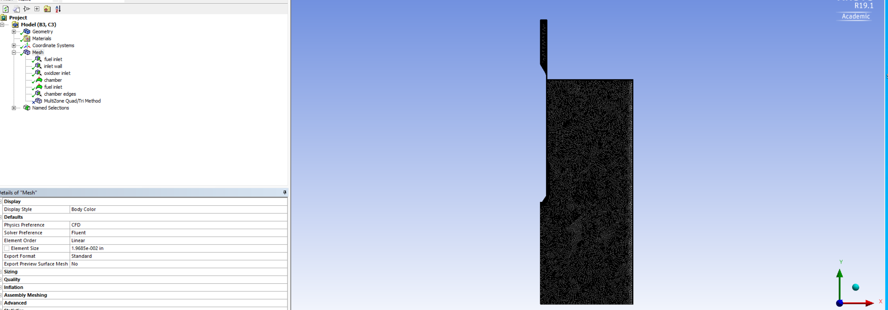

This is a picture of the mesh I used for the combustion simulation. Since the flow was turbulent, all the walls had to be meshed using the Y+ scheme corresponding to the method I picked to solve the problem.

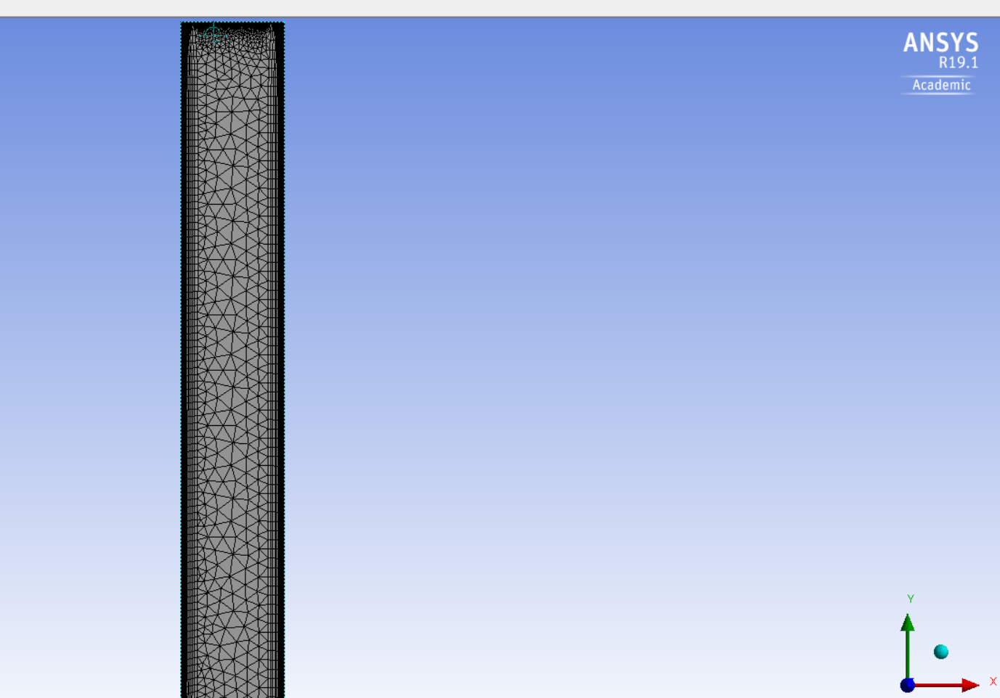

This is a closeup of the inflation that I used. The walls require the gradual increase in layers to account for the large viscous affects in turbulent flow.

## ANSYS

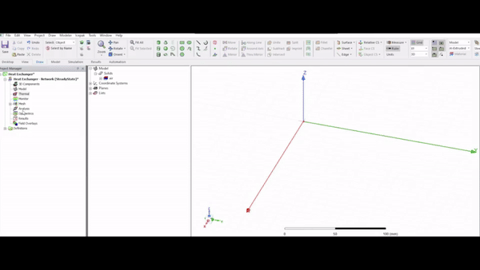

gif (jif?) of the thermal circuit heat exchanger I built for ANSYS Electronics Desktop. It allows clients to input certain parameters in the UI and will create a heat exchanger from those inputs. This type of heat exchanger is common inside computers, CPUs, and other such electrical components. If you have access to an ANSYS Workbench, you can find my creation on Icepak.

It was designed on ANSYS component 3D modeler software. The creation of the heat-exchanger is done using python code; I'm not manually creating the cube and splitting the upper surface into multiple surfaces.

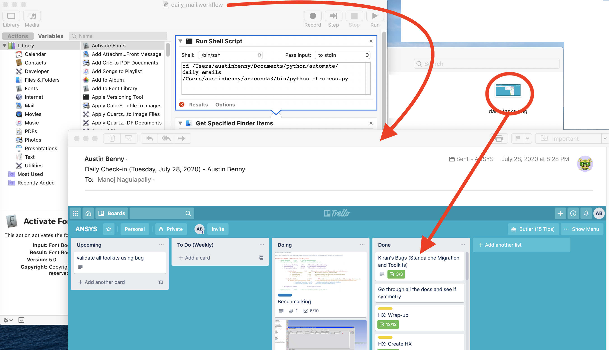

Email automation work done using OS X automator and python for ANSYS internship. The automator workflow file on the left produces the email sent to go out to my manager every day at 8:00 PM sharp. The python script produces the screenshot shown inside the circle on the right. The automator workflow creates the email, attaches the screenshot, and sends it to Manoj.

